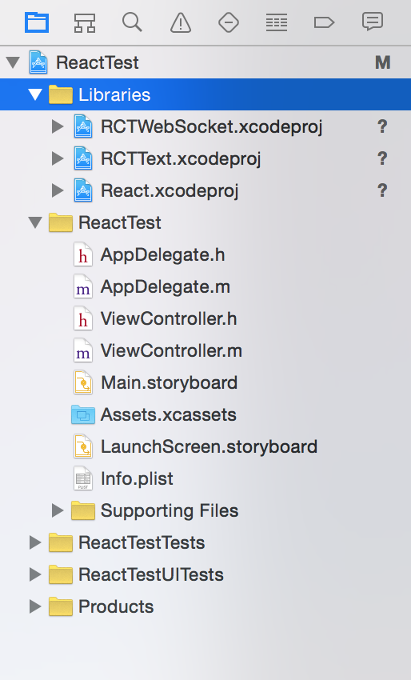
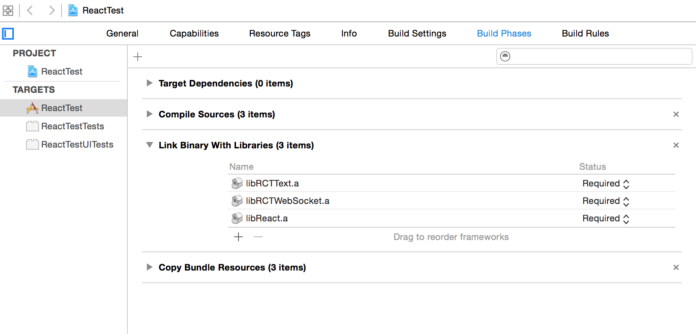
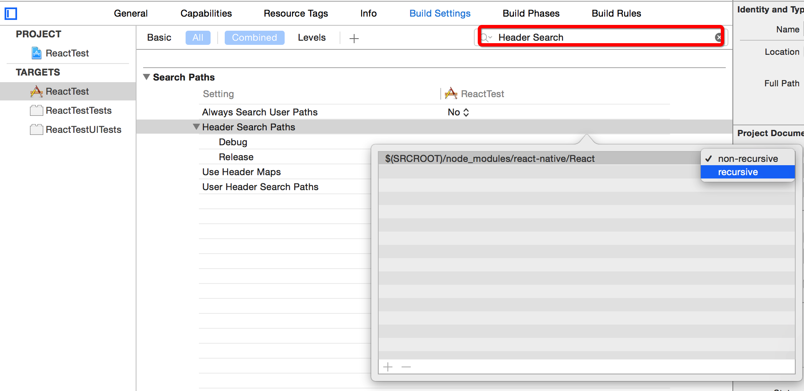
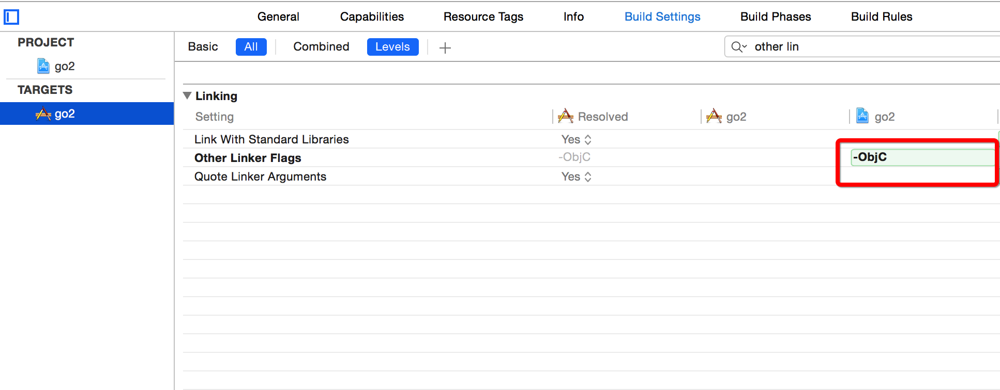

# React Native 与 App 集成方案
##一、前言
Facebook提供了“Integrating with Existing Apps”方案，但是需要使用````pod install````, 会出现版本更新不及时。那么如何手动集成到Native代码中去呢？这里提供一个简单的Demo供参考。      

##二、构建步骤
	1. 创建 React Native项目，目的是获取最新的React Native包
	$ react-native init test     
	2. 创建 Native项目，例如ReactTest
	3. 将test/node_modules拷贝到ReactTest根目录下
	4. 在ReactTest项目中创建Group：Libraries
	5. 在Group：Libraries中添加依赖的React Native项目：
		/node_modules/react-native/React/React.xcodeproj
		/node_modules/react-native/Libraries/Text/RCTText.xcodeproj
		/node_modules/react-native/Libraries/WebSocket/RCT WebSocket.xcodeproj       
	
	添加完成如下图     
	
	

	6. Build Rules中添加静态库文件，如下图         
	
       


	7.添加依赖循环    
	$(SRCROOT)/node_modules/react-native/React
	如下图所示：       

      

8.修改AppDelegate.m应用启动代码      
   
	
	#import "AppDelegate.h"
	#import "ViewController.h"

	@interface AppDelegate ()
	@end

	@implementation AppDelegate


	- (BOOL)application:(UIApplication *)application didFinishLaunchingWithOptions:(NSDictionary *)launchOptions {
	    if(!self.window){
	        self.window = [[UIWindow alloc]init];
	    }
	    
	    self.window.frame = [[UIScreen mainScreen]bounds];
	    self.window.backgroundColor = [UIColor whiteColor];
	    self.window.rootViewController = [ViewController new];
	    [self.window makeKeyAndVisible];
	    return YES;
	}	   
	
	
	
	
9.在ViewController.m中调用React Native和Native混编         
 
	
	#import "ViewController.h"
	#import "RCTRootView.h"

	@interface ViewController ()

	@end

	@implementation ViewController

	- (void)viewDidLoad {
	    [super viewDidLoad];
	    UIButton *searchBtn = [[UIButton alloc]init];
	    searchBtn.frame = CGRectMake(0 + 5, 0, 100, 100);
	    searchBtn.backgroundColor = [UIColor colorWithRed:0.000 green:0.569 blue:1.000 alpha:1];
	    [searchBtn setTitle:@"搜索" forState:UIControlStateNormal];
	    [searchBtn setTitle:@"搜索" forState:UIControlStateHighlighted];
	    
	    NSURL *jsCodeLocation;
	    jsCodeLocation = [NSURL URLWithString:@"http://localhost:8081/index.ios.bundle?platform=ios&dev=true"];
	    RCTRootView *rootView = [[RCTRootView alloc] initWithBundleURL:jsCodeLocation
	                                                        moduleName:@"Study"
	                                                 initialProperties:nil
	                                                     launchOptions:nil];
	    rootView.frame = [[UIScreen mainScreen]bounds];
	    [self.view addSubview:rootView];
	    [self.view addSubview:searchBtn];
	    

	}

	- (void)didReceiveMemoryWarning {
	    [super didReceiveMemoryWarning];
	    // Dispose of any resources that can be recreated.
	}

	@end  
	 

10.还需要设置下Other Linker Flags, 如下图

	       
   
   
   	11. OK 享受编程吧   

		
	       
