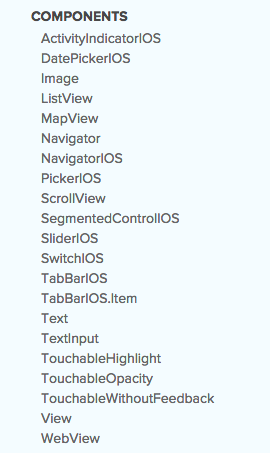
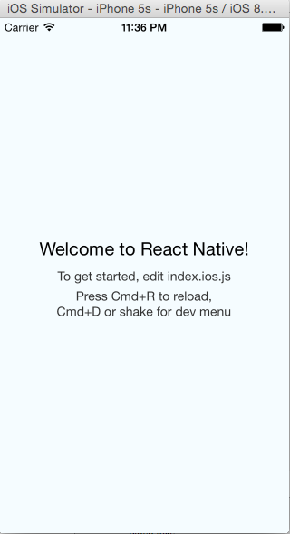
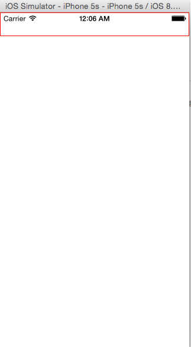
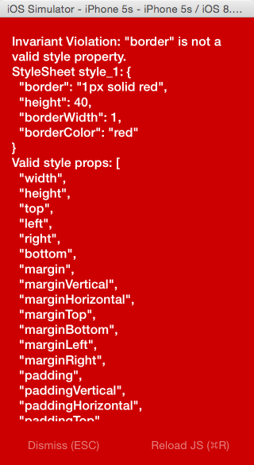
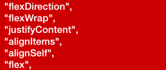
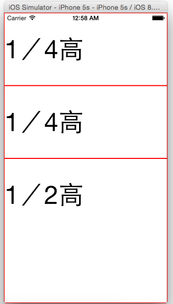
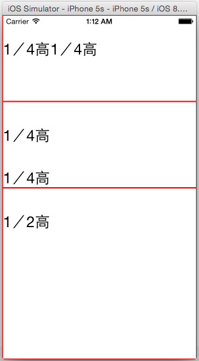
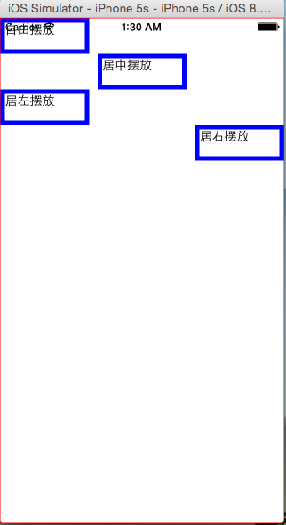
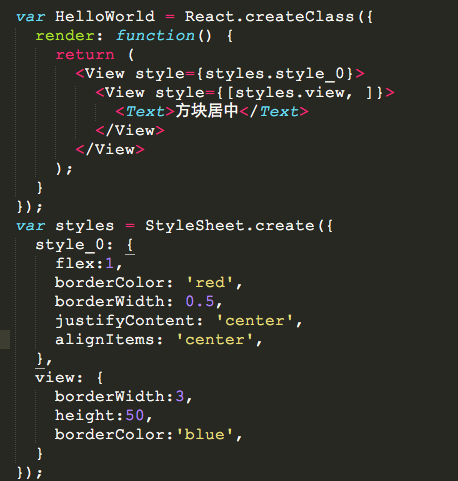
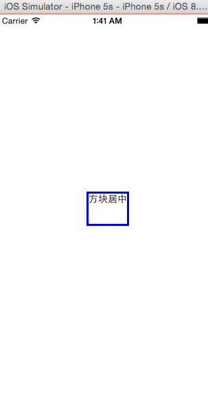

#React-Native入门指南

##第3篇CSS和UI布局

###一、了解React-Native组件
	作为开发者都知道，UI组件对于一个应用的重要性。也许，在一款应用中，你还没有完整的，有体系的构建UI组件，但是你一定或多或少有种想把组件抽出来的冲动，就像有些冲动是人类的本能一样....这是作为一个开发者的本能。那么组件的复用和统一话是十分必要的。常见的组件有：日历、下来列表（常在应用中表现为下拉刷新）、导航栏、头部、底部、选项卡等等。React-Native就提供了一套iOS原生的组件，这样就不用HTML5去模拟组件了。React-Native使用css来构建页面布局，使用Native iOS Components给我们提供强大的组件功能。目前已有组件如下图：

###二、使用CSS样式 & Flexbox布局
	第一篇，已经知道了如何构建工程。这里同样创建一个HelloWorld工程。默认启动界面如下图：
	

	1、基本样式
	这里使用View和Text组件作为演示对象，首先，修改index.ios.js里面的代码，这里只需要关注StyleSheet和render里面的模板。修改后的代码如下：
	/**
	* Sample React Native App
	* https://github.com/facebook/react-native
	*/
	'use strict';
	
	var React = require('react-native');
	var {
		AppRegistry,
		StyleSheet,
		Text,
		View,
	} = React;

	var HelloWorld = React.createClass({
		render: function() {
    		return (
      			<View>
        			<View></View>
      			</View>
    		);
    	}
	});

	var styles = StyleSheet.create({
	});

	AppRegistry.registerComponent('HelloWorld', () => HelloWorld);
	这时候，你cmd + R刷新模拟器应该看到是空白的界面。现在，是展现css魅力的时候了。React-native使用的css 表达是一个JS自面量对象，并且严格区分该对象属性的类型，所以要遵循对象的写法，而不能使用以前css的写法，这个需要自己熟悉了。
	（1）增加一个带边框的矩形，红色边框
		直接在组件上添加样式是这样的：style={{height:40, borderWidth: 1, borderColor: 'red'}}style是组件的一个自有属性，第一个{}JS执行环境或者说是模板，第二个{}只是css样式对象的括号而已(慢慢体会,不难理解)。这样修改后的代码如下：
		render: function() {
    		return (
      			<View>
        			<View style={{height:40, borderWidth: 1, borderColor: 'red'}}>

        			</View>
      			</View>
    		);
    	}
    	cmd ＋ R刷新模拟器，结果如下：
 
 
 		(2)如何知道该组件支持哪些样式呢？
 		上面的已经很简单了，作为web开发者用脚趾头都能闭眼写出来。如果我们需要知道该组件又哪些样式，又不用查手册，一个最为简单的方法是，在样式表里写错一个属性，比如我写一个没有的属性“border”。但是该属性必须写到样式的创建中去，而不能写为内联样式。写成内联样式，你是看不到报错提示的。我门改写成样式表创建类里面：
 		var HelloWorld = React.createClass({
  			render: function() {
    				return (
      					<View>
        					<View style={styles.style_1}>

        					</View>
     					</View>
    				);
  			}
		});

		var styles = StyleSheet.create({
  			style_1:{
    			border: '1px solid red',
    			height:40, 
    			borderWidth: 1,  
    			borderColor: 'red',
  			}
		});
 		 这个时候你就能齐刷刷的看到样式表的报错和提示有哪些样式了，如下图所示：
  
 
 		（3）独立样式类
 		其实上面已经展示了独立样式类了，那么样式类创建很简单，我们只需要使用React.StyleSheet来创建类。其实创建的类就是一个js对象而已。那么在组件上引用是这样的<View style={{对象名称.对象属性}}></View>，就跟上面（2）的代码一样。
 		
 		2、说说Flexbox布局
 		其实，这样的css样式，作为web开发这一用就会，那么说说布局的事儿。除去margin, padding, position等大家熟悉的web布局的话，最为重要的就是flexbox，目前支持的属性如下,有6个：
   		
 		
 		 (1)先说flex属性，上一段代码
			var HelloWorld = React.createClass({
  				render: function() {
    				return (
      					<View style={styles.style_0}>
        					<View style={styles.style_1}></View>
        					<View style={styles.style_1}></View>
        					<View style={{flex:10}}></View>
        				</View>
    				);
  				}
			});

			var styles = StyleSheet.create({
  				style_0:{
    				flex:1,
  				},
  				style_1:{
    				flex: 5,
    				height:40, 
    				borderWidth: 1,  
    				borderColor: 'red',
 				}
			});
			当一个(元素)组件，定义了flex属性时，表示改元素是可伸缩的。当然flex的属性值是大于0的时候才伸缩，其他小于和等于0的时候不伸缩，例如：flex:0, flex:-1等。上面的代码，最外层的view是可伸缩的，因为没有兄弟节点和他抢占空间。里层是3个view,可以看到三个view的flex属性加起来是5+5+10=20,所以第一个view和第二个view分别占1／4伸缩空间， 最后一个view占据1／2空间，具体如下图：

		(2)	flexDirection
		flexDirection在React-Native中只有两个属性，一个是row(横向伸缩)和column(纵向伸缩)。具体的想过可见如下代码：
		var HelloWorld = React.createClass({
  			render: function() {
   				return (
      				<View style={styles.style_0}>
        				<View style={styles.style_1}>
          				<Text style={{marginTop:40, fontSize:25}}>1／4高</Text>
          				<Text style={{marginTop:40, fontSize:25}}>1／4高</Text>
        			</View>
       	 			<View style={[styles.style_1, {flexDirection: 'column'}]}>
          				<Text style={{marginTop:40, fontSize:25}}>1／4高</Text>
          				<Text style={{marginTop:40, fontSize:25}}>1／4高</Text>
       				</View>
        			<View style={{flex:10, borderWidth: 1, borderColor: 'red',}}>
          				<Text style={{marginTop:40, fontSize:25}}>1／2高</Text>
        				</View>
     				</View>
    			);
  			}
		});

		var styles = StyleSheet.create({
  			style_0:{
    			flex:1,
  			},
  			style_1:{
    			flex: 5,
    			flexDirection: 'row',
    			height:40, 
    			borderWidth: 1,  
    			borderColor: 'red',
  			}
		});
		具体的效果如下：

		
		(3)alignSelf:对齐方式
		alignSelf的对齐方式主要有四种：flex-start、 flex-end、 center、  auto、 stretch。看看代码，应该就很清楚了：
		

		效果如下图
	
		
		（4）水平垂直居中
		alignItems是alignSelf的变种，跟alignSelf的功能类似，可用于水平居中；justifyContent用于垂直居中，属性较多，可以了解下。

		效果如下图
	
