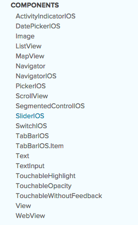
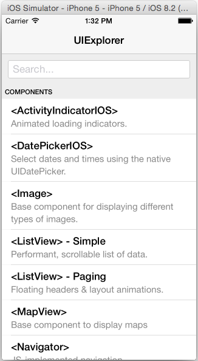
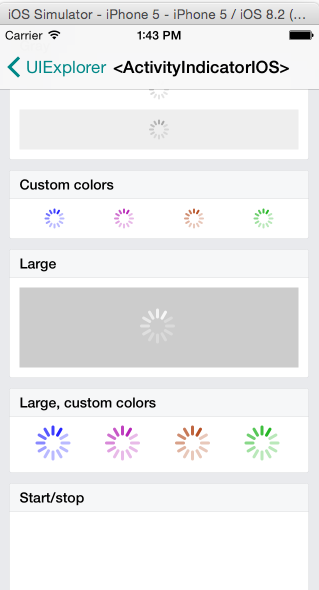
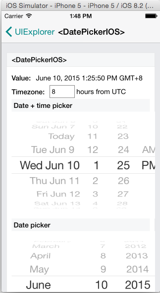
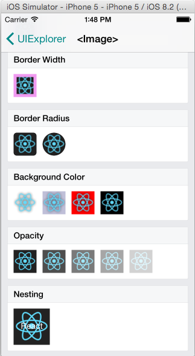
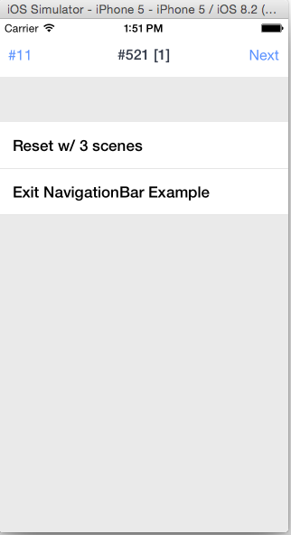
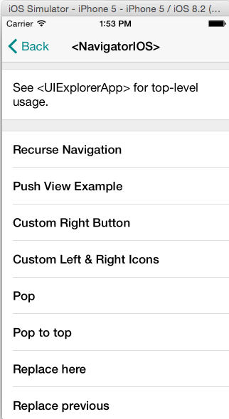
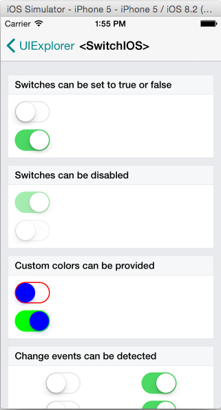

#React-Native入门指南
##第5篇UI组件
###一、目前React-Native支持的组件
	在facebook React-native的官网可以看到目前支持的组件如下：
	https://facebook.github.io/react-native/docs/getting-started.html#content

###二、如何正确运行UI组件Example
	我们可以到react-native的github项目地址找到example,地址是https://github.com/facebook/react-native/tree/master/Examples/UIExplorer。下载react-native的代码库，将UIExplorer目录下的所有文件拷贝到你新建的项目中。其实UIExplorerApp.js就是整个项目的启动的文件。有两种方式可以启动项目：
	
	1、第一种是修改jsCodeLocation = [NSURL URLWithString:@"http://localhost:8081/index.ios.bundle"];
	
	2、第二种就是将UIExplorerApp.js里面的代码复制到index.ios.js中，此时，注意：
	AppRegistry.registerComponent('HelloWorld', () => UIExplorerApp);
	HelloWorld是你的项目名称，如果已经启动项目，需要确保这个名称一致。
	
	项目启动后的界面如下，你就可改改UI组件看效果了。

###三、活动指示器组件
	其实，每个组件如何使用，可以到demo中去看代码。这里做简单的介绍.活动指示器组件可以做loading,下拉刷新等
	

###四、日历组件	
	

###五、图片组件	
	

###六、列表组件	
	

###七、导航器组件
	

###八、导航组件
	

###九、开关组件
	

	其余组件可以查看demo运行和学习，其实就是相当于html标签，具有某种功能，习惯就好。

